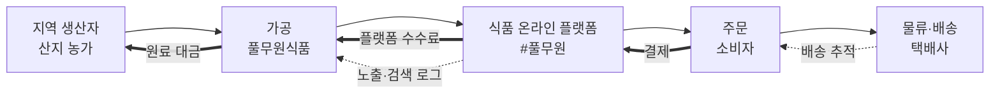

# 밸류체인 맵 v0 — 풀무원 (검증 전 초안, 보관용)

트랙 기본 체인과 원페이지만 보고 쓴 초안. 일부 라벨은 수업 템플릿에서 옴.

```mermaid
flowchart LR
  A["지역 생산자<br/>산지 농가"] --> B["가공<br/>풀무원식품"] --> C["식품 온라인 플랫폼<br/>#풀무원"] --> D["주문<br/>소비자"] --> E["물류·배송<br/>택배사"]
  D ==>|"결제"| C
  C ==>|"플랫폼 수수료"| B
  B ==>|"원료 대금"| A
  C -.->|"노출·검색 로그"| B
  E -.->|"배송 추적"| D
```
